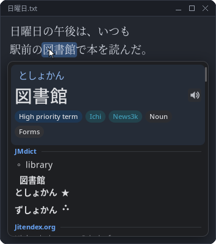
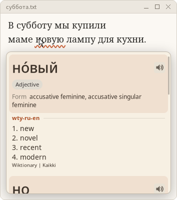
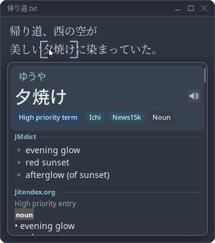

# Lexiglance

[](https://github.com/MattFor/lexiglance/actions/workflows/ci.yml)
[](https://github.com/MattFor/lexiglance/releases)
[](LICENSE)

Ever tried learning a language and gotten frustrated because pop-up dictionaries only work inside your browser? Worry no
more!

Lexiglance is a system-wide pop-up dictionary for Linux (X11) and Windows. Hold a key combination and point at a word
in any application to see its definitions. It supports Japanese, Russian, Ukrainian, Korean and Greek, and uses the
same dictionary format as [Yomitan](https://yomitan.wiki/).

<p>
  
  
  
</p>

**[Download for Windows](https://github.com/MattFor/lexiglance/releases/latest/download/lexiglance-windows-setup.exe)**
· **[Download for Linux](https://github.com/MattFor/lexiglance/releases/latest/download/lexiglance-x86_64.AppImage)**
· [Other packages](https://github.com/MattFor/lexiglance/releases/latest)

## Features

- Reads text through the accessibility interfaces (AT-SPI, UI Automation), or with OCR (PaddleOCR, Tesseract) in
  games, images and videos.
- Dictionaries are compiled into memory-mapped indexes.
- Deinflection: 食べさせられなかった finds 食べる, книгами finds книга.
- Recommended dictionaries for each language can be installed from the settings application.
- Pronunciation audio, and Anki cards through AnkiConnect.
- Configurable popup designs, colour schemes and highlight styles ([docs/themes.md](docs/themes.md)).
- A health check that diagnoses common setup problems.
- No input injection and no access to other processes, it won't trigger any anti-cheats - feel free to use it in games!
  ([details](docs/anticheat.md)).

## Install

- **Windows 10 (1809 or later) and 11:** download
  [lexiglance-windows-setup.exe](https://github.com/MattFor/lexiglance/releases/latest/download/lexiglance-windows-setup.exe)
  and run it. Administrator permissions are not needed, it may also warn about an unknown publisher: choose **More
  info -> Run anyway**. Running a newer one updates in place.
- **Linux:** download
  [lexiglance-x86_64.AppImage](https://github.com/MattFor/lexiglance/releases/latest/download/lexiglance-x86_64.AppImage),
  make it executable (`chmod +x lexiglance-x86_64.AppImage`) and run it.

The [releases page](https://github.com/MattFor/lexiglance/releases) also has a portable `.zip` for Windows, a `.deb`
for Debian and Ubuntu, and a `.tar.gz`. From then on Lexiglance keeps itself up to date (**Overview -> Updates**).

## Getting started

1. Open **Dictionaries -> Get recommended dictionaries**, pick a language and install.
2. Hold **Super + Left Alt** (on Windows **Win + Left Alt**) and point at a word.
3. Turn the mouse wheel to look up more or less of the text. Left-click an entry to copy it. Right-click and select text
   within a pop up box to copy it instead.

For games, videos and other programs that expose no text, click **Scanning -> Download PaddleOCR** once. On Linux,
Chromium and Electron apps need `--force-renderer-accessibility`.

## Languages

Each language is a small JSON file, and you can add your own without rebuilding. See
[docs/languages.md](docs/languages.md).

## Building

You need CMake 3.28+, GCC 14 or Clang 18+, zlib, Cairo, Pango, libcurl and Qt 6.4+. On Linux also Xlib (with XInput2,
XFixes, XRandR, Xext) and AT-SPI 2.

```sh
cmake --preset release
cmake --build --preset release
ctest --preset release
```

Then run `build/release/apps/gui/lexiglance`. For Windows builds see [docs/porting.md](docs/porting.md).

## Files

Settings are in `~/.config/lexiglance`, dictionaries, OCR models and language files in `~/.local/share/lexiglance`.  
On
Windows they are in `%APPDATA%\Lexiglance\config` and `%LOCALAPPDATA%\Lexiglance\data`.

`lexiglancectl` controls Lexiglance from scripts, for example `lexiglancectl pause` or `lexiglancectl lookup 食べた`.

## Contributing

See [CONTRIBUTING.md](CONTRIBUTING.md). Please report security problems privately, see [SECURITY.md](SECURITY.md).

## LLM Disclosure & My Own Notes

Yes, this one was mostly written with the help of an LLM. I wanted to get the program up and running as quickly as
possible so that my friends and I could start using it in our language-learning journeys. Writing everything by hand
would have taken a very, very long time!

Of course, I still review the code and documentation myself. I don't want to get completely lost in the madness :D

I hope Lexiglance can be a useful tool to others and help everyone on their own language-learning journey!

## License

MIT [LICENSE](LICENSE).  
By MattFor

Dictionaries, OCR models and recordings are downloaded separately and keep their own
licenses. Lexiglance includes the ONNX Runtime headers (MIT), a kanji table
from [OpenCC](https://github.com/BYVoid/OpenCC) (Apache 2.0) and
[Breeze](https://invent.kde.org/frameworks/breeze-icons) icons (LGPL 3.0).
